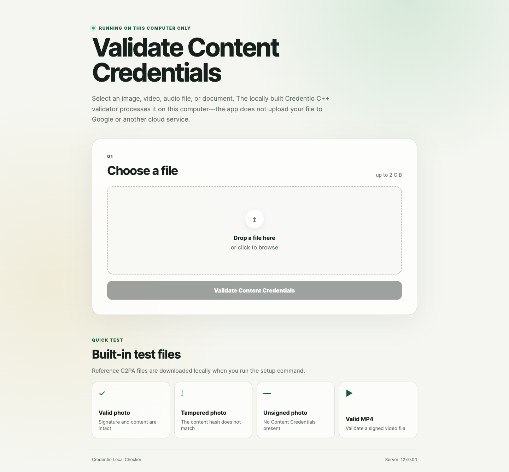
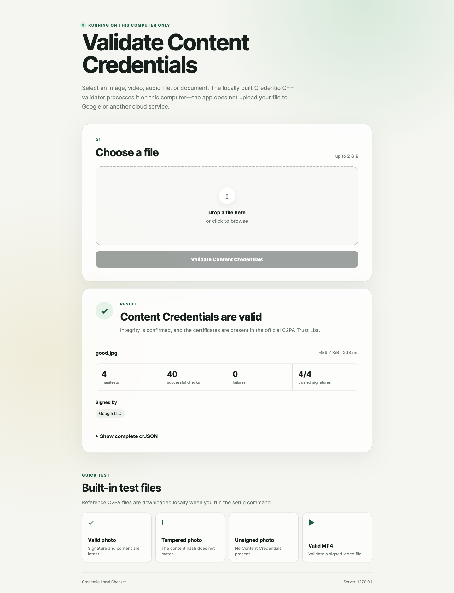
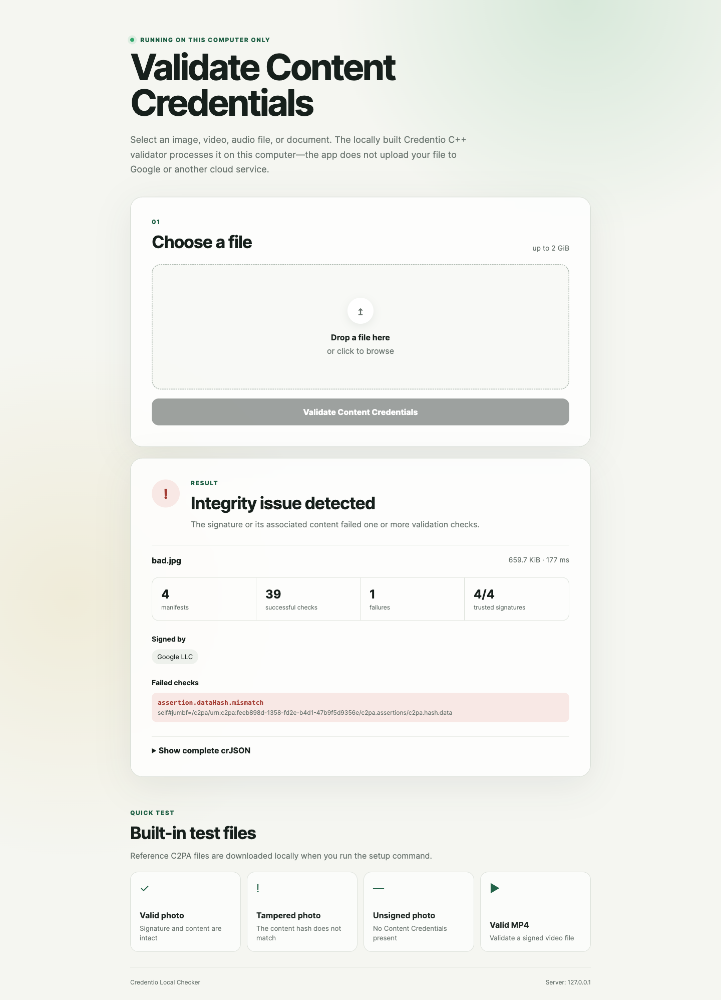
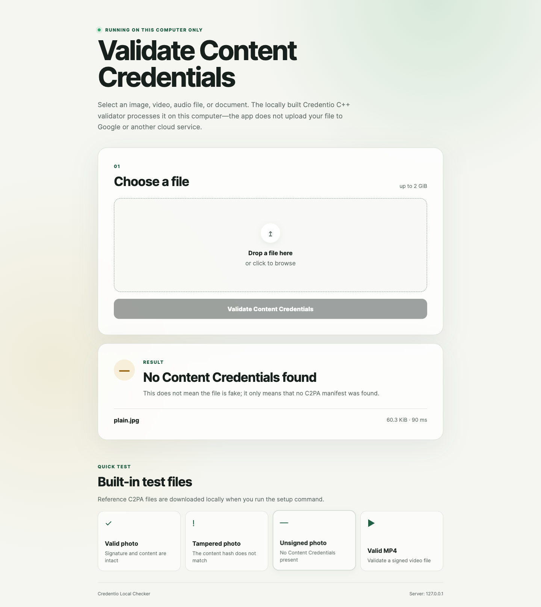

# Credentio Local Checker

A small, privacy-focused web interface for validating [C2PA Content Credentials](https://c2pa.org/) with Google's open-source [Credentio](https://mediaprovenance.googlesource.com/credentio/) C++ library.

The app runs on your computer, accepts a file through a local browser interface, invokes a locally built Credentio binary, and presents the validation result in a human-readable form.

> [!IMPORTANT]
> This is an independent experimental project. It is not an official Google or C2PA product and is not endorsed by either organization.

## Screenshots

### Local interface

[](docs/screenshots/interface-overview.png)

### Built-in validation scenarios

Each screenshot shows the test asset, the validation outcome, and the details reported by Credentio. Select an image to open it at full resolution.

| Valid JPEG | Tampered JPEG |
| --- | --- |
| [](docs/screenshots/valid-photo-result.png) | [](docs/screenshots/tampered-photo-result.png) |
| **Unsigned JPEG** | **Valid MP4** |
| [](docs/screenshots/unsigned-photo-result.png) | [](docs/screenshots/valid-video-result.png) |

## What it does

- Validates Content Credentials in supported images, video, audio, and documents.
- Reports manifest integrity, certificate trust, and C2PA validation failures.
- Uses pinned revisions of Credentio, LibCppBor, the C2PA trust lists, and test assets.
- Verifies SHA-256 checksums for downloaded trust lists and sample files.
- Streams an uploaded file to a permission-restricted temporary directory and deletes it immediately after validation.
- Binds the web server to `127.0.0.1`, so it is not exposed to other devices on the network.
- Includes valid, tampered, unsigned, and video samples for a quick local demonstration.

## What it does not do

- It does not detect AI-generated media by analyzing pixels, frames, or audio.
- It does not search the internet for the original source of a file.
- It does not prove that the scene or statement depicted by a file is factually true.
- It does not add, sign, or embed new Content Credentials.

No Content Credentials is a neutral result: the file may be authentic, synthetic, edited, or simply processed by software that did not preserve C2PA metadata. A valid credential confirms the integrity of the signed provenance data; its usefulness still depends on whether you trust the signer.

## Requirements

The setup script currently targets macOS and requires:

- Node.js 20 or newer
- Git
- Xcode Command Line Tools (`xcode-select --install`)
- An internet connection for the initial dependency and sample download

The project has been tested on Apple Silicon. The first native build may take several minutes and uses Bazel's local cache on subsequent runs.

## Quick start

```bash
npm install
npm run setup
npm start
```

Open <http://127.0.0.1:3210>. Press `Ctrl+C` in the terminal to stop the server.

`npm run setup` downloads pinned source revisions into the ignored `.runtime/` directory, checks known hashes, builds the Credentio CLI, downloads the official trust lists, and installs four public test assets. Generated sources, binaries, trust lists, and test media are not committed to this repository.

## Test the app

Run all automated tests:

```bash
npm test
```

Run syntax checks and tests together:

```bash
npm run check
```

The integration test is skipped automatically until `npm run setup` has completed. Once the runtime exists, it verifies all four included scenarios:

| Sample | Expected result |
| --- | --- |
| Valid JPEG | Valid credentials with a trusted signer |
| Tampered JPEG | Invalid due to a content hash mismatch |
| Unsigned JPEG | No Content Credentials |
| Valid MP4 | Valid video credentials |

## Supported extensions

Support is determined by the pinned Credentio build.

- Images: `avif`, `dng`, `gif`, `heic`, `heif`, `jpeg`, `jpg`, `png`, `tif`, `tiff`, `webp`
- Video and audio: `avi`, `m4a`, `mov`, `mp3`, `mp4`, `wav`, `flac`
- Documents: `pdf`, `docx`, `pptx`, `xlsx`

## Configuration

The server always listens on the loopback interface. You can change the port and upload limit without making it reachable from the local network:

```bash
PORT=4321 MAX_UPLOAD_BYTES=536870912 npm start
```

| Variable | Default | Description |
| --- | ---: | --- |
| `PORT` | `3210` | Local HTTP port |
| `MAX_UPLOAD_BYTES` | `2147483648` | Maximum accepted file size in bytes (2 GiB) |

## Privacy and security

- Selected assets are sent only from your browser to the local `127.0.0.1` server.
- The app does not upload the asset to Google or another cloud service.
- Temporary asset files are created with owner-only permissions and removed in a `finally` block after validation.
- Cross-origin POST requests are rejected, and the UI is served with a restrictive Content Security Policy.
- Raw crJSON is displayed only in the local browser. It may contain provenance metadata already embedded in the asset.
- The setup step makes outbound requests to download pinned open-source dependencies, trust lists, and public samples.

Do not expose this development server through port forwarding, a reverse proxy, or a public tunnel. See [SECURITY.md](SECURITY.md) for reporting guidance and additional precautions.

## Project structure

```text
public/              Browser interface
docs/screenshots/    README and publication-ready interface captures
lib/credentio.mjs    Credentio process wrapper and result summarizer
scripts/setup.mjs    Reproducible download and native build setup
test/                Unit and integration tests
server.mjs           Loopback-only Node.js HTTP server
.runtime/            Generated local runtime (ignored by Git)
```

## Third-party software and test data

This repository does not vendor Credentio or its test assets. The setup script downloads pinned revisions from their original public sources:

- [Google Credentio](https://mediaprovenance.googlesource.com/credentio/) — Apache License 2.0
- [Android LibCppBor](https://android.googlesource.com/platform/system/libcppbor/) — Apache License 2.0
- [C2PA conformance trust lists](https://github.com/c2pa-org/conformance-public)
- [C2PA public test files](https://github.com/c2pa-org/public-testfiles)
- [c2pa-rs sample image](https://github.com/contentauth/c2pa-rs)

Their respective licenses and terms apply to the downloaded material. "Google", "Credentio", "C2PA", and other names may be trademarks of their respective owners.

## Status

This is a local research and demonstration tool, not a production verification service. Credentio is under active development, and its interfaces or supported formats may change. The setup script intentionally pins known revisions so that this version remains reproducible.

## License

The original code in this repository is available under the [MIT License](LICENSE). Downloaded third-party components remain under their own licenses.
